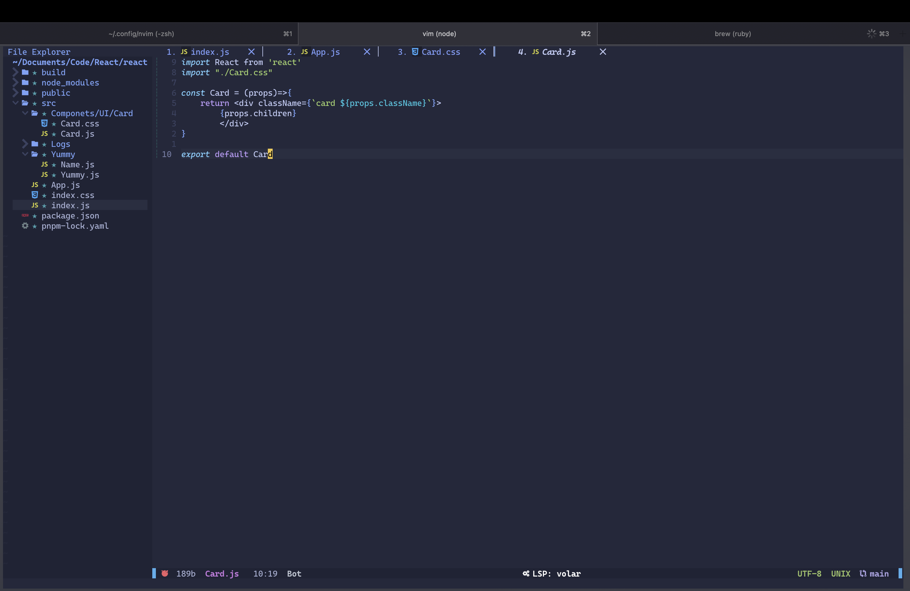
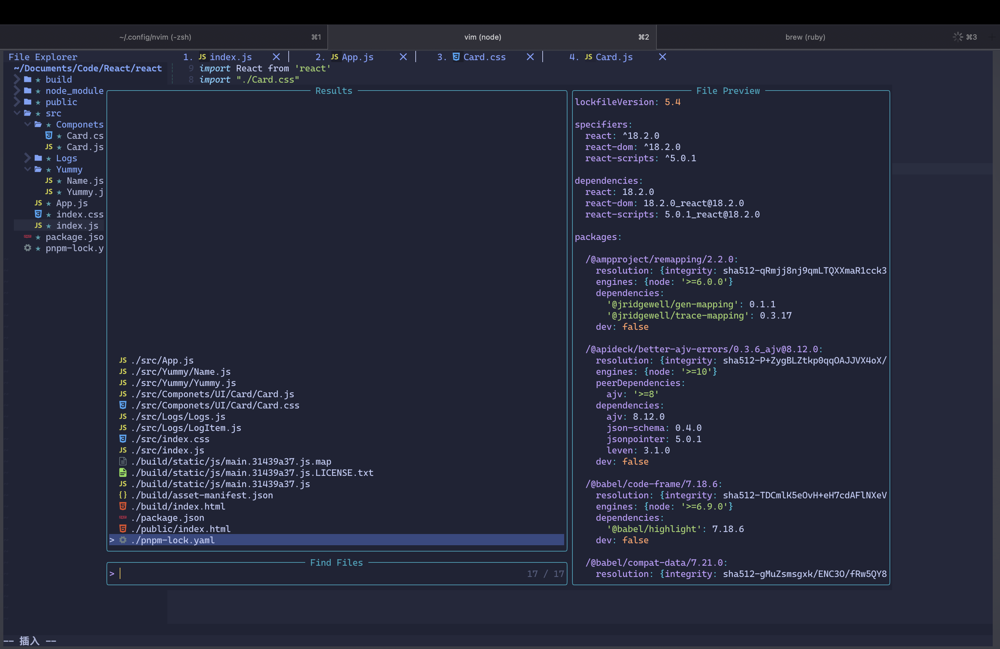

## Carckzj nvim

> 个人`neovim`配置文件,参考了知乎和自己在`github`查看的一些插件教程
> 
> 
> 

## features
> 自动切换输入法(从insert模式换为其他模式时，自动切换为英文输入法，目前只适配了macos)

## 快捷键

- 翻页: `Ctrl + k`上翻10行，`Ctrl + j`下翻10行

- 窗口操作: 

- `Ctrl + b`: 打开/关闭文件查看`nvim-tree`

- `Space + 数字`: 跳转对应`buffer`

## 已安装插件列表

- rafamadriz/friendly-snippets

- kyazdni42/nvim-web-devicons

> A lua fork of vim-devicons. This plugin provides the same icons as well as colors for each icon.
>
> 为`nvim-tree`提供字体图标，实现类似`vscode`的样式
>
> `packer`安装: `use 'nvim-tree/nvim-web-devicons'`
>
> `Setup`

```
require'nvim-web-devicons'.setup {
 -- your personnal icons can go here (to override)
 -- you can specify color or cterm_color instead of specifying both of them
 -- DevIcon will be appended to `name`
 override = {
  zsh = {
    icon = "",
    color = "#428850",
    cterm_color = "65",
    name = "Zsh"
  }
 };
 -- globally enable different highlight colors per icon (default to true)
 -- if set to false all icons will have the default icon's color
 color_icons = true;
 -- globally enable default icons (default to false)
 -- will get overriden by `get_icons` option
 default = true;
 -- globally enable "strict" selection of icons - icon will be looked up in
 -- different tables, first by filename, and if not found by extension; this
 -- prevents cases when file doesn't have any extension but still gets some icon
 -- because its name happened to match some extension (default to false)
 strict = true;
 -- same as `override` but specifically for overrides by filename
 -- takes effect when `strict` is true
 override_by_filename = {
  [".gitignore"] = {
    icon = "",
    color = "#f1502f",
    name = "Gitignore"
  }
 };
 -- same as `override` but specifically for overrides by extension
 -- takes effect when `strict` is true
 override_by_extension = {
  ["log"] = {
    icon = "",
    color = "#81e043",
    name = "Log"
  }
 };
}
```

- neovim/nvim-lspconfig

- glepnir/dashboard-nvim

- nvim-tree/nvim-tree.lua
> 已映射`Ctrl + B` 打开/关闭文件资源管理器
> `A File Explorer For Neovim Written In Lua`
> [git地址](https://github.com/nvim-tree/nvim-tree.lua)
> 使用`packer`安装：
```
use {
  'nvim-tree/nvim-tree.lua',
  requires = {
    'nvim-tree/nvim-web-devicons', -- optional, for file icons
  },
  tag = 'nightly' -- optional, updated every week. (see issue #1193)
}
```

- hrsh7th/cmp-vsnip

- hrsh7th/cmp-cmdline

- hrsh7th/cmp-path

- hrsh7th/nvim-cmp

- hrsh7th/cmp-buffer

- windwp/nvim-autopairs

- nvim-treesitter/nvim-treesitter

- lewis6991/gitsigns.nvim

- akinsho/bufferline.nvim

- simrat39/symbols-outline.nvim

- akinsho/toggleterm.nvim

- nvim-telescope/telescope.nvim/0.1.x

- neovim/nvim-lspconfig

- wbthomason/packer.nvim

- mfussenegger/nvim-dap

- nvim-lua/plenary.nvim

- kylechui/nvim-surround


## `nvim-treesitter` 配置

> `nvim-treesitter`目前提供以下功能

- 代码高亮
- 增量选择
- `=`代码格式化
- 折叠

> 代码高亮配置已启动，可使用`TSBufToggle highlight`启用代码文件高亮或关闭

> 代码选择：在`normal`模式下，使用`enter`可以增量选择代码,`Backspace`可以减少选择

> 代码格式化：`=`可以格式化选择的代码块，`tips: gg=G`可以格式化整个文件

> 折叠代码块：`zc`，`zo`可以折叠/展开`{}`里面的内容
